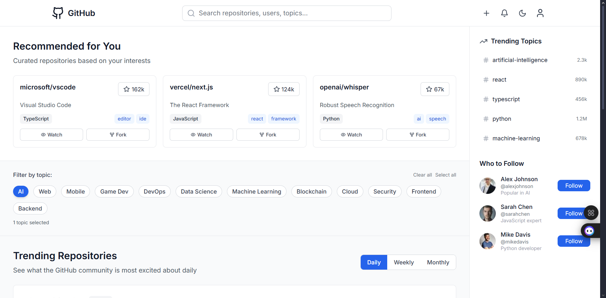
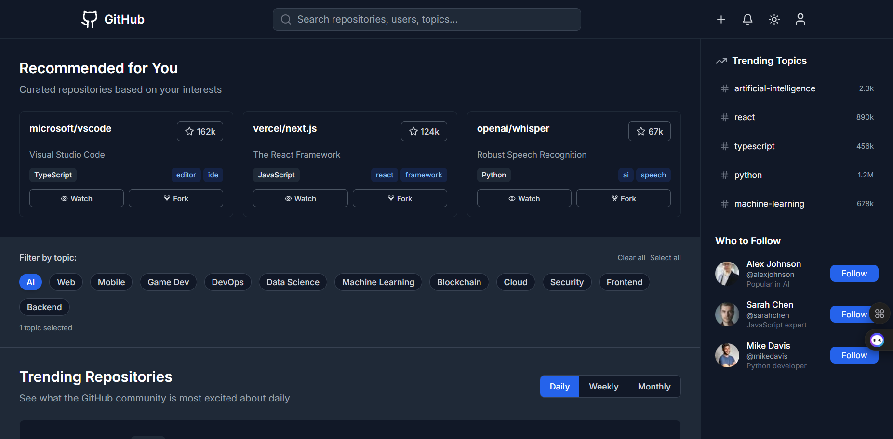
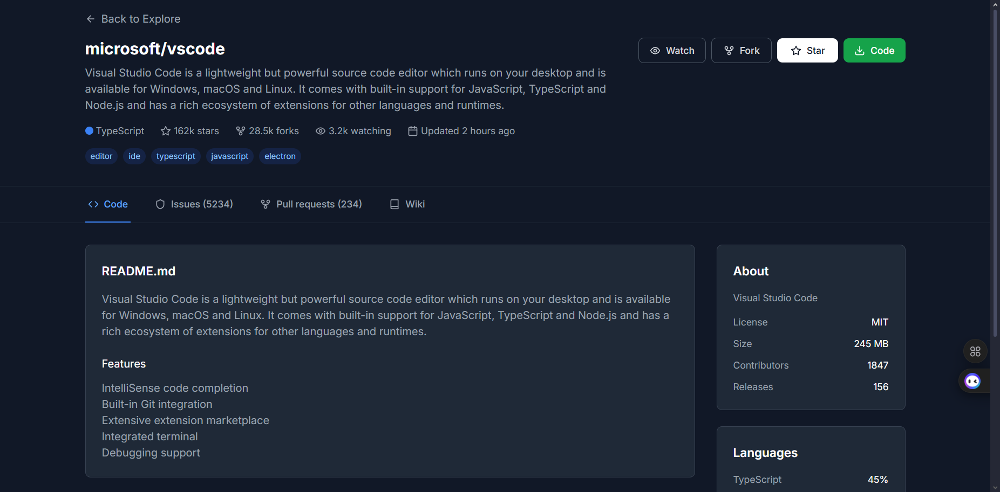
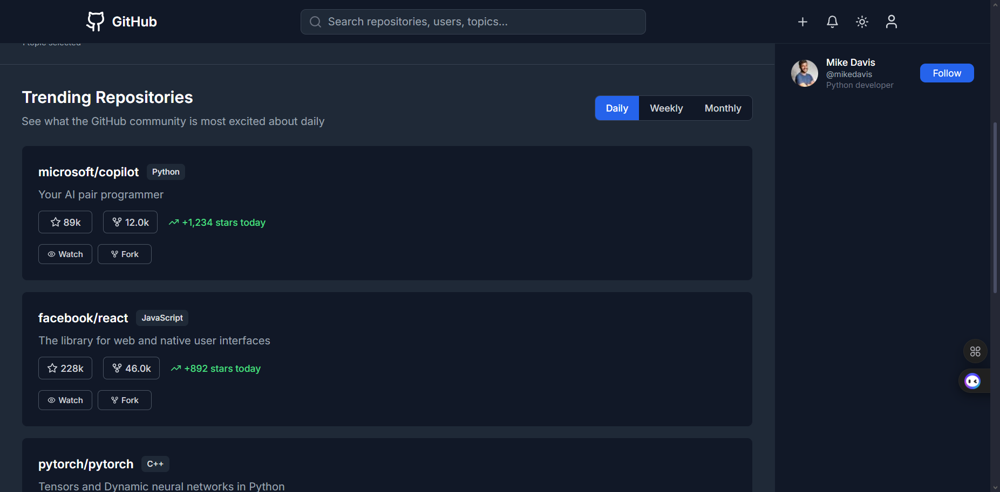
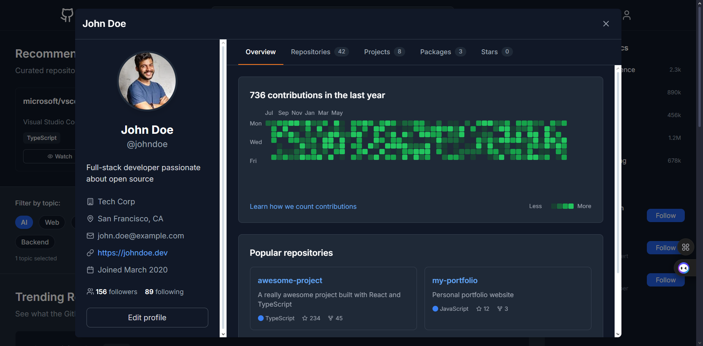
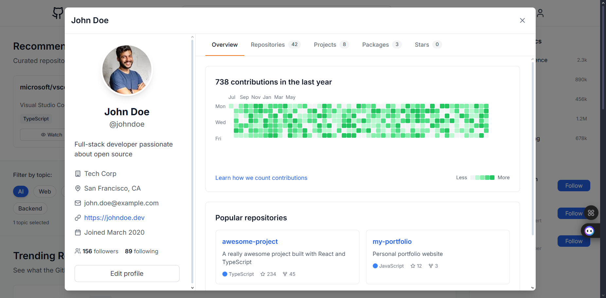

# 🔍 GitHub Explore – Discover Repositories Like Never Before


> A modern GitHub exploration platform to discover trending repositories, follow developers, and manage your coding interests with enhanced personalization and a clean, responsive interface.


## Features

- 🔥 Trending Repositories (Daily/Weekly/Monthly)
- 🧠 Personalized Recommendations (mocked)
- 🏷️ Category & Topic Filters
- ⭐ Star/Unstar Repositories
- 👥 Follow/Unfollow Developers
- 🧑‍💻 GitHub-style Contribution Graph
- 🧾 Editable Profile with Avatar Upload
- 🌗 Dark/Light Mode with System Preference
- 🔍 Global Search (Repos & Users)
- 📱 Fully Responsive Layout
- 🧪 Error Handling, Loading States & UX Feedback
## Technology Used

| Technology    | Purpose                               |
|---------------|----------------------------------------|
| **React 18 + TS** | Frontend framework with type safety  |
| **Vite**         | Lightning-fast dev/build environment |
| **Tailwind CSS** | Utility-first responsive styling     |
| **Context API**  | Theme/Profile state management       |
| **LocalStorage** | Persistent user settings             |

## 🚀 Installation

Install **Github-Explore-Page** locally with the following steps:

```bash
# Step 1: Clone the repository
git clone https://github.com/Faizan960/Github-Explore-Page

# Step 2: Navigate into the project directory
cd Github-Explore-Page

# Step 3: Install project dependencies
npm install

# Step 4: Start the development server
npm run dev
```
## 🖼️ Preview

### 🔸 Home Page



### 🔸 Dark Mode



### 🔸 Repo Section



### 🔸 Trending Section



### 🔸 Profile Section





## Folder Sturcture

src/
├── components/
│   ├── Navbar.tsx
│   ├── HeroSection.tsx
│   ├── TrendingSection.tsx
│   ├── CategoryFilters.tsx
│   ├── DeveloperSpotlight.tsx
│   ├── Sidebar.tsx
│   ├── ProfileModal.tsx
│   └── RepositoryPage.tsx
├── contexts/
│   ├── ThemeContext.tsx
│   └── ProfileContext.tsx
├── App.tsx
└── main.tsx

## Author

**Faizan Patel**  
👨‍💻 DevOps & Full Stack Enthusiast  
📍 Mumbai, India  
📸 [Instagram](https://instagram.com/_faizanx_x)

## Roadmap

- [x] Dark/Light theme toggle
- [x] Mocked trending/filtering system
- [x] Editable user profile
- [ ] GitHub OAuth login
- [ ] Real GitHub API integration
- [ ] Real-time updates via WebSocket
- [ ] E2E tests with Cypress
- [ ] GitHub Actions CI/CD
## 📄 License

MIT License

Copyright (c) 2025 Faizan Patel

Permission is hereby granted, free of charge, to any person obtaining a copy  
of this software and associated documentation files (the "Software"), to deal  
in the Software without restriction, including without limitation the rights  
to use, copy, modify, merge, publish, distribute, sublicense, and/or sell  
copies of the Software, and to permit persons to whom the Software is  
furnished to do so, subject to the following conditions:

The above copyright notice and this permission notice shall be included in all  
copies or substantial portions of the Software.

THE SOFTWARE IS PROVIDED "AS IS", WITHOUT WARRANTY OF ANY KIND, EXPRESS OR  
IMPLIED, INCLUDING BUT NOT LIMITED TO THE WARRANTIES OF MERCHANTABILITY,  
FITNESS FOR A PARTICULAR PURPOSE AND NONINFRINGEMENT. IN NO EVENT SHALL THE  
AUTHORS OR COPYRIGHT HOLDERS BE LIABLE FOR ANY CLAIM, DAMAGES OR OTHER  
LIABILITY, WHETHER IN AN ACTION OF CONTRACT, TORT OR OTHERWISE, ARISING FROM,  
OUT OF OR IN CONNECTION WITH THE SOFTWARE OR THE USE OR OTHER DEALINGS IN THE  
SOFTWARE.
